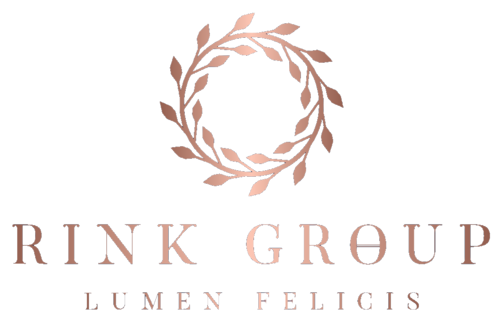

<p align="center">
  
</p>

<h1 align="center">Rink Group — Lumen Felicis</h1>

<p align="center">
  <strong>Strategic holding · Nordic heritage · Global ambition</strong>
</p>

<p align="center">
  <a href="https://rinkgroup-site.vercel.app">🌐 Live Site</a> ·
  <a href="#architecture">Architecture</a> ·
  <a href="#features">Features</a> ·
  <a href="#tech-stack">Stack</a> ·
  <a href="#getting-started">Getting Started</a>
</p>

<p align="center">
  
  
  
  
  
  
  
</p>

---

## ✦ Overview

The digital presence of **Rink Group OY** — a strategic holding company operating at the intersection of technology, nature, maritime, and consulting. Built with an "old money" design philosophy: restrained luxury, cinematic scroll experiences, and understated elegance.

> *"Lumen Felicis"* — The Light of Fortune

---

## Architecture

```
rinkgroup-site/
├── app/
│   ├── api/
│   │   ├── chat/route.ts          # Claude AI streaming chat proxy
│   │   └── tts/route.ts           # ElevenLabs TTS proxy
│   ├── components/
│   │   ├── AetherBot.tsx           # 🤖 AI chat widget (voice + streaming)
│   │   ├── ContactSection.tsx      # CTA with expanding radial animation
│   │   ├── CustomCursor.tsx        # Rose-gold cursor with spring physics
│   │   ├── Footer.tsx              # Minimal footer with locations
│   │   ├── HeritageSection.tsx     # Values grid + scroll-driven vertical line
│   │   ├── HeroSection.tsx         # Sticky scroll hero + parallax zoom-out
│   │   ├── LanguageSwitcher.tsx    # 4-language toggle (EN|NL|FI|AR)
│   │   ├── MarqueeBand.tsx         # Scroll-driven parallax marquee
│   │   ├── Navigation.tsx          # Glass nav + mobile overlay + i18n
│   │   ├── ParticleLaurel.tsx      # HiDPI canvas · 400+ particles
│   │   ├── PhilanthropySection.tsx # Canine welfare initiative
│   │   ├── PillarsSection.tsx      # 5 ventures in 12-col grid
│   │   ├── ScrollProgress.tsx      # Rose-gold shimmer progress bar
│   │   ├── SmoothScroll.tsx        # Lenis smooth scrolling
│   │   └── VisionSection.tsx       # Word-by-word scroll reveal
│   ├── i18n/
│   │   ├── LanguageContext.tsx      # React context + localStorage
│   │   └── translations.ts         # EN, NL, FI, AR translations
│   ├── globals.css                  # Design system + Tailwind v4
│   ├── layout.tsx                   # Root layout + 4 Google Fonts
│   ├── page.tsx                     # Page composition
│   └── not-found.tsx                # Custom 404
├── public/
│   └── logo-rinkgroup.png           # Transparent logo (extracted)
├── tailwind.config.ts
├── tsconfig.json
└── next.config.ts
```

---

## Features

### 🎨 Design — "Oud Geld" Aesthetic

| Element | Implementation |
|---------|---------------|
| **Color palette** | Navy deep `#080E1A` → Rose gold `#C5956B` gradient spectrum |
| **Typography** | Playfair Display (display), Cormorant Garamond (serif), Outfit (sans), Noto Sans Arabic (RTL) |
| **Custom cursor** | Rose-gold dot + ring with `useSpring` physics, magnetic hover on interactive elements |
| **Noise overlay** | SVG fractal noise at 1.8% opacity for film grain texture |
| **Vignette** | Radial gradient darkening at edges for cinematic framing |
| **Shimmer** | 300% background-size animation on progress bars and hover states |

### 🌊 Scroll Experiences

| Section | Effect |
|---------|--------|
| **Hero** | Sticky scroll (140vh), logo parallax zoom-out, vignette, fade overlay |
| **Vision** | Word-by-word reveal — each word transitions from blur(8px) + opacity(0.08) to sharp |
| **Marquee bands** | Horizontal parallax translation linked to scroll progress |
| **Heritage** | Central vertical line scales on scroll, parallax quote movement |
| **Contact** | Expanding radial circle animation (scale 0 → 1.5) |
| **Pillars** | Alternating left/right slide-in per card based on scroll position |

### 🎆 Particle System — Laurel Wreath

The `ParticleLaurel` component renders a **HiDPI canvas** with 400+ particles in 3 categories:

| Type | Count | Behavior |
|------|-------|----------|
| **Ring** | 300 | Form the wreath shape, connected by luminous lines |
| **Leaf** | 480 | Outward clusters with breathing motion |
| **Dust** | 80 | Floating ambient particles |

Features: mouse repulsion with spring-back, cross-sparkle stars, connection lines between ring particles, `devicePixelRatio` scaling.

### 🤖 AetherBot — AI Chat Widget

A floating AI assistant powered by **Claude Sonnet** with voice capabilities:

- **Streaming responses** via Server-Sent Events
- **Voice input** — Web Speech API (Dutch language)
- **Text-to-Speech** — ElevenLabs v3 with v2 fallback
- **Full knowledge base** — All Rink Group ventures, values, and contact info
- **Rose-gold UI** — Animated glow orb, breathing header light, suggestion buttons
- **Markdown rendering** with bold highlights

```
User → /api/chat → Claude Sonnet (streaming SSE) → Widget
User → 🎤 Web Speech API → /api/chat → Claude → Widget → /api/tts → ElevenLabs → 🔊
```

### 🌍 Internationalization (i18n)

| Language | Code | Direction | Font |
|----------|------|-----------|------|
| English | `en` | LTR | Outfit / Playfair |
| Nederlands | `nl` | LTR | Outfit / Playfair |
| Suomi | `fi` | LTR | Outfit / Playfair |
| العربية | `ar` | RTL | Noto Sans Arabic |

- React Context with `localStorage` persistence
- Automatic `dir="rtl"` and `lang` attribute switching
- Reduced letter-spacing for Arabic readability
- All 8 sections fully translated

---

## Ventures

| # | Venture | Domain | Description |
|---|---------|--------|-------------|
| I | **AetherLink B.V.** | Technology | AI consulting & intelligent automation (€225/hr) |
| II | **TaigaSchool** | Nature | Eco-hospitality in Kuusamo wilderness (180 ha) |
| III | **Van Diemen AOS** | Maritime | Ship recycling & maritime decommissioning |
| IV | **WorldLine** | Consulting | Senior AI consulting for European payment tech |
| V | **Solvari Design** | Platform | Design system for Benelux home improvement |

---

## Tech Stack

| Layer | Technology |
|-------|-----------|
| **Framework** | Next.js 16.1 (App Router, Turbopack) |
| **UI** | React 19 + TypeScript (strict) |
| **Styling** | Tailwind CSS 4 (`@theme inline` tokens) |
| **Animation** | Framer Motion 12 (scroll-driven, spring physics) |
| **Smooth Scroll** | Lenis 1.3 |
| **Canvas** | Native Canvas API (HiDPI particle system) |
| **AI Chat** | Anthropic Claude Sonnet (streaming) |
| **Voice** | Web Speech API (STT) + ElevenLabs (TTS) |
| **Fonts** | Google Fonts (Playfair, Cormorant, Outfit, Noto Arabic) |
| **Deploy** | Vercel (serverless functions for API routes) |

---

## Getting Started

### Prerequisites

- Node.js 18+
- npm or yarn

### Installation

```bash
git clone https://github.com/Maca2024/rinkgroup-site.git
cd rinkgroup-site
npm install
```

### Environment Variables

Create `.env.local`:

```env
ANTHROPIC_API_KEY=sk-ant-...
ELEVENLABS_API_KEY=sk_...
```

### Development

```bash
npm run dev        # Start dev server on http://localhost:3000
npm run build      # Production build
npm run start      # Start production server
```

### Deploy

```bash
npx vercel --prod  # Deploy to Vercel
```

---

## Design Tokens

```css
--color-navy:            #142242
--color-navy-deep:       #080E1A
--color-navy-mid:        #0F1B33
--color-rose-gold:       #C5956B
--color-rose-gold-light: #D4A574
--color-rose-gold-pale:  #E8CDB5
--color-cream:           #F5F0E8
```

---

## Values

| Latin | Translation | Principle |
|-------|-------------|-----------|
| **Prudentia** | Prudence | Strategic patience as competitive advantage |
| **Integritas** | Integrity | Our word is our bond |
| **Fortitudo** | Fortitude | Building for decades, not quarters |
| **Humanitas** | Humanity | Every living being deserves dignity |

---

<p align="center">
  <sub>
    <strong>Helsinki · Amsterdam · Kuusamo</strong><br/>
    © 2026 Rink Group OY — Lumen Felicis<br/><br/>
    Built with ♠ by <a href="https://aetherlink.ai">AetherLink B.V.</a>
  </sub>
</p>
